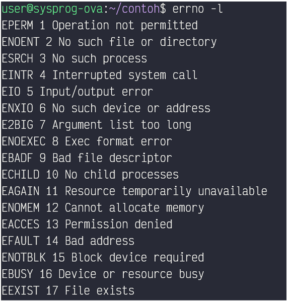

# System Call

## Definisi
System call adalah komunikasi dari process pada user mode yang memerlukan kernel untuk melakukan sesuatu. System call diperlukan karena process memerlukan kode yang hanya bisa diakses pada kernel mode. Namun, karena kita tidak bisa berganti dari user mode ke kernel mode secara langsung, maka diperlukan system call agar bisa berganti mode

## Hubungan antara user mode, kernel mode, dan system call
Ketika process user berjalan, maka akan memanggil system call. Pada user mode, hanya mengeksekusi kode yang tidak berbahaya. Namun, beberapa instruksi mesin diperlukan ketika menjalankan program. Hanya kernel mode yang dapat mengakses instruksi mesin tersebut. Namun, untuk bisa masuk ke kernel mode, diharuskan pemanggilan system call. Setelah itu akan digenerate trap mode yang bitnya akan berganti menjadi 0. System call akan dieksekusi. Ketika selesai, trap mode akan berganti bitnya dari 0 menjadi 1. Bisa dikatakan system call diperlukan untuk menghubungkan user mode dan kernel mode ketika memerlukan akses ke kernel mode

## Contoh System Call

| System call | Fungsi                                                 |
| :------------- | :------------------------------------------------------------------------- |
| `fork()`        | Membuat child process                                                           |
| `close()`        | Menutup filte descriptor                                                          |
| `kill()`        | Mengirim sinyal terminasi ke sebuah process                                                         |
| `exit()`        | Mengakhiri pemanggilan process                                                          |

## Identifikasi Error

Kita dapat menggunakan command `strace` untuk melakukan tracing system call yang dijalankan dari suatu process. Error pada suatu system call biasanya dapat diidentifikasi apabila ketika system call berjalan, nilai yang direturn adalah nilai negatif, biasanya -1. Selain nilai negatif yang muncul, terdapat simbol errno dan string penjelasan error. Dari string penjelasan error tersebut kita dapat mengidentifikasi error yang terjadi.

Dengan menjalankan `errno -l`, kita bisa melihat sebagian daftar kode error:

