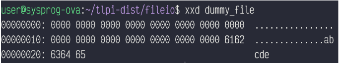

# Stat System Call

## Stat structure

Stat structure adalah struktur sistem yang menyimpan informasi file. Stat structure digunakan di beberapa system call: stat, fstat, lsat.

Informasi yang disimpan di stat structure:

- st_dev – identifier device yang mengandung file
- st_ino – nomor inode
- st_mode – mode proteksi
- st_nlink – reference count dari hard links
- st_uid – identifier user dari owner
- st_gid – identifier group dari owner
- st_rdev – identifier device
- st_size – total file size, dalam bytes
- st_atime – waktu terakhir akses
- st_mtime – waktu terakhir modifikasi
- st_ctime – waktu terakhir status berubah
- st_blksize – block size I/0
- st_blocks – jumlah blok yang dialokasikan di DEV_BSIZE

## stat, lstat, dan fstat

`stat()` memberikan informasi mengenai file dari file yang sedang ditunjuk oleh pathname. `lstat()` fungsinya sama dengan `stat()`, namun pathname pada `lstat()` berupa symbolic link dan mereturn informasi mengenai link. `fstat()` mereturn file yang direferensikan file descriptor yang terbuka.

## File descriptor​ and ​File description

File descriptor adalah integer di aplikasi yang mengacu ke file description di kernel. File description adalah struktur di kernel yang maintain state dari file yang dibuka.

## Proses yang tidak membutuhkan File Descriptor

Ada, dipastikan bahwa proses tersebut merupakan proses daemon (proses yang berjalan di background). Hal ini dikarenakan proses tersebut akan menutup semua deskriptor file yang terbuka untuk memastikan tidak adanya file descriptor yang ada pada proses daemon.

Akan tetapi, kebanyakan daemon masih mempunyai file descriptor. Namun, jika ada process yang tidak mempunyai file descriptor, dipastikan bahwa proses tersebut merupakan daemon.

## File Holes

Apakah kita dapat melakukan operasi I/O melebihi
batas end of file (EOF)? Ternyata, jika kita melakukan read(), akan direturn hasil 0. Namun, kita bisa menuliskan byte pada poin yang melebihi end of file. Space antara end of file sebelumnya sampai byte yang akan ditulis, dinamakan **file hole**. Byte pada hole itu ada, namun jika diread, akan mereturn 0 (null byte),

Berikut ilustrasi dari file hole:

